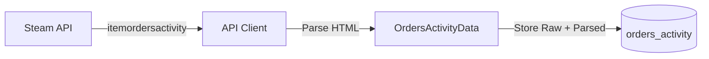

## Overview

The `orders_activity` table stores snapshots of recent trade activity - a real-time feed of actual purchases and new listings as they happen on the Steam Market.

**Data Source:** `itemordersactivity` API endpoint

**Update Frequency:** Real-time (seconds)

**Use Case:** Monitor trading velocity, detect price movements, track market sentiment

## Table Schema

<ResponseField name="id" type="INTEGER" required>
  Auto-incrementing primary key for each record
</ResponseField>

<ResponseField name="timestamp" type="DATETIME" default="CURRENT_TIMESTAMP">
  When this snapshot was taken (UTC)
</ResponseField>

<ResponseField name="appid" type="INTEGER" required>
  Steam application ID (730 for CS2, 570 for Dota 2, etc.)
</ResponseField>

<ResponseField name="market_hash_name" type="TEXT" required>
  Exact Steam market name
</ResponseField>

<ResponseField name="item_nameid" type="INTEGER" required>
  Steam's internal numeric item ID (required for this endpoint)
</ResponseField>

<ResponseField name="currency" type="TEXT" required>
  ISO 4217 currency code (USD, EUR, GBP, etc.)
</ResponseField>

<ResponseField name="country" type="TEXT" required>
  Two-letter country code used for the request
</ResponseField>

<ResponseField name="language" type="TEXT" required>
  Language used for the request
</ResponseField>

<ResponseField name="activity_raw" type="TEXT">
  JSON array of raw HTML activity strings from Steam's API
  
  Example:
  ```json
  [
    "<div>+3 at $5.25</div>",
    "<div>-1 at $5.30</div>"
  ]
  ```
</ResponseField>

<ResponseField name="parsed_activities" type="TEXT">
  JSON array of parsed activity objects with structured data
  
  Each object contains:
  - `price` (string) - The transaction price
  - `action` (string) - Type of activity ("buy", "sell", "listing")
  - `timestamp` (string) - When the activity occurred (ISO format)
  
  Example:
  ```json
  [
    {
      "price": "$5.25",
      "action": "buy",
      "timestamp": "2024-03-03T12:34:56Z"
    }
  ]
  ```
</ResponseField>

<ResponseField name="activity_count" type="INTEGER">
  Number of activities in this snapshot
</ResponseField>

<ResponseField name="steam_timestamp" type="INTEGER" required>
  Unix timestamp from Steam's response indicating when the activity data was generated
</ResponseField>

## Indexes

```sql
-- Fast lookup for latest activity
CREATE INDEX idx_activity_item_time
  ON orders_activity(market_hash_name, timestamp DESC);

-- Time-based queries
CREATE INDEX idx_activity_timestamp
  ON orders_activity(timestamp DESC);
```

## Example Queries

### Get Recent Trades

```sql
SELECT timestamp, 
       parsed_activities, 
       activity_count
FROM orders_activity
WHERE market_hash_name = 'AK-47 | Redline (Field-Tested)'
ORDER BY timestamp DESC
LIMIT 10;
```

### Track Activity Volume Over Time

```sql
SELECT 
    strftime('%Y-%m-%d %H:00', timestamp) AS hour,
    SUM(activity_count) AS total_activities,
    COUNT(*) AS snapshots_captured
FROM orders_activity
WHERE market_hash_name = 'AK-47 | Redline (Field-Tested)'
  AND timestamp > datetime('now', '-24 hours')
GROUP BY strftime('%Y-%m-%d %H:00', timestamp)
ORDER BY hour DESC;
```

### Extract Individual Activities from JSON

```sql
SELECT 
    timestamp,
    json_each.value ->> '$.price' AS trade_price,
    json_each.value ->> '$.action' AS trade_action,
    json_each.value ->> '$.timestamp' AS trade_time
FROM orders_activity,
     json_each(parsed_activities)
WHERE market_hash_name = 'AK-47 | Redline (Field-Tested)'
  AND id = (SELECT MAX(id) FROM orders_activity WHERE market_hash_name = 'AK-47 | Redline (Field-Tested)')
ORDER BY trade_time DESC;
```

### Count Activities by Type

```sql
SELECT 
    date(timestamp) AS day,
    json_each.value ->> '$.action' AS action_type,
    COUNT(*) AS occurrences
FROM orders_activity,
     json_each(parsed_activities)
WHERE market_hash_name = 'AK-47 | Redline (Field-Tested)'
  AND timestamp > datetime('now', '-7 days')
GROUP BY date(timestamp), action_type
ORDER BY day DESC, occurrences DESC;
```

### Find Most Active Trading Periods

```sql
SELECT 
    strftime('%H', timestamp) AS hour_of_day,
    AVG(activity_count) AS avg_activity,
    SUM(activity_count) AS total_activity
FROM orders_activity
WHERE market_hash_name = 'AK-47 | Redline (Field-Tested)'
  AND timestamp > datetime('now', '-30 days')
GROUP BY strftime('%H', timestamp)
ORDER BY avg_activity DESC;
```

## JSON Structure Examples

### parsed_activities Format

```json
[
  {
    "price": "$5.25",
    "action": "buy",
    "timestamp": "2024-03-03T12:34:56Z"
  },
  {
    "price": "$5.30",
    "action": "sell",
    "timestamp": "2024-03-03T12:35:12Z"
  },
  {
    "price": "$5.28",
    "action": "listing",
    "timestamp": "2024-03-03T12:35:45Z"
  }
]
```

### activity_raw Format

Raw HTML strings from Steam's API (for reference):

```json
[
  "<div class='market_activity_block'>+3 at $5.25</div>",
  "<div class='market_activity_block'>-1 at $5.30</div>"
]
```

## Data Flow



## Activity Types

The `action` field in `parsed_activities` can contain:

- **buy** - Item purchased from a listing
- **sell** - New listing created
- **listing** - Listing price updated

<Note>
  Steam's activity feed format may vary by region and language. The raw HTML is preserved in `activity_raw` for custom parsing if needed.
</Note>

## Working with Activity Data

### Python Example: Parse Activities

```python
import sqlite3
import json

conn = sqlite3.connect('data/market_data.db')
cursor = conn.cursor()

cursor.execute("""
    SELECT timestamp, parsed_activities
    FROM orders_activity
    WHERE market_hash_name = 'AK-47 | Redline (Field-Tested)'
    ORDER BY timestamp DESC
    LIMIT 1
""")

row = cursor.fetchone()
if row:
    timestamp, activities_json = row
    activities = json.loads(activities_json)
    
    for activity in activities:
        print(f"{activity['action']} at {activity['price']} - {activity['timestamp']}")

conn.close()
```

## Related Tables

<CardGroup cols={2}>
  <Card title="orders_histogram" icon="chart-bar" href="/api-reference/database/orders-histogram">
    Order book depth and bid-ask spreads
  </Card>
  
  <Card title="price_overview" icon="chart-line" href="/api-reference/database/price-overview">
    Current market prices and volumes
  </Card>
</CardGroup>