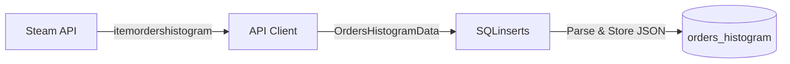

## Overview

The `orders_histogram` table stores complete order book snapshots - all buy orders and sell orders at each price level, similar to a stock market depth chart. This data shows market liquidity and the bid-ask spread.

**Data Source:** `itemordershistogram` API endpoint

**Update Frequency:** Real-time (seconds)

**Use Case:** Analyze market depth, track bid-ask spreads, identify support/resistance levels

## Table Schema

<ResponseField name="id" type="INTEGER" required>
  Auto-incrementing primary key for each record
</ResponseField>

<ResponseField name="timestamp" type="DATETIME" default="CURRENT_TIMESTAMP">
  When this snapshot was taken (UTC)
</ResponseField>

<ResponseField name="appid" type="INTEGER" required>
  Steam application ID (730 for CS2, 570 for Dota 2, etc.)
</ResponseField>

<ResponseField name="market_hash_name" type="TEXT" required>
  Exact Steam market name
</ResponseField>

<ResponseField name="item_nameid" type="INTEGER" required>
  Steam's internal numeric item ID (required for this endpoint)
</ResponseField>

<ResponseField name="currency" type="TEXT" required>
  ISO 4217 currency code (USD, EUR, GBP, etc.)
</ResponseField>

<ResponseField name="country" type="TEXT" required>
  Two-letter country code used for the request
</ResponseField>

<ResponseField name="language" type="TEXT" required>
  Language used for the request
</ResponseField>

<ResponseField name="buy_order_table" type="TEXT">
  JSON array of buy orders: `[{"price": 5.25, "quantity": 10}, ...]`
  
  Each object contains:
  - `price` (float) - The bid price
  - `quantity` (int) - Number of orders at this price
</ResponseField>

<ResponseField name="sell_order_table" type="TEXT">
  JSON array of sell orders: `[{"price": 5.50, "quantity": 8}, ...]`
  
  Each object contains:
  - `price` (float) - The ask price
  - `quantity` (int) - Number of orders at this price
</ResponseField>

<ResponseField name="buy_order_graph" type="TEXT">
  JSON array for visualization: `[[price, quantity, label], ...]`
  
  Structured for charting libraries
</ResponseField>

<ResponseField name="sell_order_graph" type="TEXT">
  JSON array for visualization: `[[price, quantity, label], ...]`
  
  Structured for charting libraries
</ResponseField>

<ResponseField name="buy_order_count" type="INTEGER">
  Total number of buy orders in the order book
</ResponseField>

<ResponseField name="sell_order_count" type="INTEGER">
  Total number of sell orders in the order book
</ResponseField>

<ResponseField name="highest_buy_order" type="REAL">
  Best bid price (highest price someone is willing to pay)
</ResponseField>

<ResponseField name="lowest_sell_order" type="REAL">
  Best ask price (lowest price someone is willing to sell for)
</ResponseField>

## Indexes

```sql
-- Fast lookup for latest order book
CREATE INDEX idx_histogram_item_time
  ON orders_histogram(market_hash_name, timestamp DESC);

-- Time-based queries
CREATE INDEX idx_histogram_timestamp
  ON orders_histogram(timestamp DESC);
```

## Example Queries

### Get Current Bid-Ask Spread

```sql
SELECT timestamp, 
       highest_buy_order AS bid,
       lowest_sell_order AS ask,
       (lowest_sell_order - highest_buy_order) AS spread,
       (lowest_sell_order - highest_buy_order) / lowest_sell_order * 100 AS spread_pct
FROM orders_histogram
WHERE market_hash_name = 'AK-47 | Redline (Field-Tested)'
ORDER BY timestamp DESC
LIMIT 1;
```

### Extract Full Order Book

```sql
SELECT timestamp, 
       buy_order_table, 
       sell_order_table
FROM orders_histogram
WHERE market_hash_name = 'AK-47 | Redline (Field-Tested)'
ORDER BY timestamp DESC
LIMIT 1;
```

### Track Order Book Depth Over Time

```sql
SELECT timestamp, 
       buy_order_count, 
       sell_order_count,
       (buy_order_count + sell_order_count) AS total_orders
FROM orders_histogram
WHERE market_hash_name = 'AK-47 | Redline (Field-Tested)'
  AND timestamp > datetime('now', '-24 hours')
ORDER BY timestamp;
```

### Query Top Buy Order Using JSON

```sql
SELECT 
    timestamp,
    json_extract(buy_order_table, '$[0].price') AS top_bid_price,
    json_extract(buy_order_table, '$[0].quantity') AS top_bid_quantity
FROM orders_histogram
WHERE market_hash_name = 'AK-47 | Redline (Field-Tested)'
ORDER BY timestamp DESC 
LIMIT 1;
```

### Analyze Spread Volatility

```sql
SELECT 
    date(timestamp) AS day,
    AVG(lowest_sell_order - highest_buy_order) AS avg_spread,
    MIN(lowest_sell_order - highest_buy_order) AS min_spread,
    MAX(lowest_sell_order - highest_buy_order) AS max_spread
FROM orders_histogram
WHERE market_hash_name = 'AK-47 | Redline (Field-Tested)'
  AND timestamp > datetime('now', '-30 days')
GROUP BY date(timestamp)
ORDER BY day DESC;
```

## JSON Structure Examples

### buy_order_table Format

```json
[
  {"price": 5.25, "quantity": 10},
  {"price": 5.20, "quantity": 15},
  {"price": 5.15, "quantity": 8}
]
```

### sell_order_table Format

```json
[
  {"price": 5.30, "quantity": 12},
  {"price": 5.35, "quantity": 9},
  {"price": 5.40, "quantity": 20}
]
```

## Data Flow



## Working with JSON Data

SQLite provides powerful JSON functions:

```sql
-- Extract all buy orders as individual rows
SELECT 
    timestamp,
    json_each.value ->> '$.price' AS price,
    json_each.value ->> '$.quantity' AS quantity
FROM orders_histogram,
     json_each(buy_order_table)
WHERE market_hash_name = 'AK-47 | Redline (Field-Tested)'
  AND id = (SELECT MAX(id) FROM orders_histogram WHERE market_hash_name = 'AK-47 | Redline (Field-Tested)')
ORDER BY price DESC;
```

## Related Tables

<CardGroup cols={2}>
  <Card title="price_overview" icon="chart-line" href="/api-reference/database/price-overview">
    Current market prices and trading volume
  </Card>
  
  <Card title="orders_activity" icon="clock-rotate-left" href="/api-reference/database/orders-activity">
    Recent trade activity feed
  </Card>
</CardGroup>