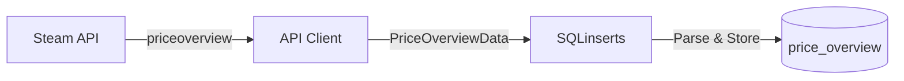

## Overview

The `price_overview` table stores snapshots of current market prices - the exact data you would see if you looked at an item's Steam Market listing page at that moment in time.

**Data Source:** `priceoverview` API endpoint

**Update Frequency:** Real-time (seconds)

**Use Case:** Track current market conditions, detect price movements, monitor trading volume

## Table Schema

<ResponseField name="id" type="INTEGER" required>
  Auto-incrementing primary key for each record
</ResponseField>

<ResponseField name="timestamp" type="DATETIME" default="CURRENT_TIMESTAMP">
  When this snapshot was taken (UTC)
</ResponseField>

<ResponseField name="appid" type="INTEGER" required>
  Steam application ID
  - `730` - Counter-Strike 2
  - `570` - Dota 2
  - `440` - Team Fortress 2
  - `753` - Steam (trading cards, emoticons)
</ResponseField>

<ResponseField name="market_hash_name" type="TEXT" required>
  Exact Steam market name (e.g., "AK-47 | Redline (Field-Tested)")
</ResponseField>

<ResponseField name="item_nameid" type="INTEGER">
  Steam's internal numeric item ID (may be null if not provided)
</ResponseField>

<ResponseField name="currency" type="TEXT" required>
  ISO 4217 currency code (USD, EUR, GBP, JPY, etc.)
</ResponseField>

<ResponseField name="country" type="TEXT" required>
  Two-letter country code used for the request (US, GB, DE, etc.)
</ResponseField>

<ResponseField name="language" type="TEXT" required>
  Language used for the request (english, french, german, etc.)
</ResponseField>

<ResponseField name="lowest_price" type="REAL">
  The cheapest current listing price (parsed from Steam's formatted string)
</ResponseField>

<ResponseField name="median_price" type="REAL">
  The median sale price from recent transactions
</ResponseField>

<ResponseField name="volume" type="INTEGER">
  Number of sales in the last 24 hours
</ResponseField>

## Indexes

```sql
-- Fast lookup for latest item prices
CREATE INDEX idx_overview_item_time
  ON price_overview(market_hash_name, timestamp DESC);

-- Time-based queries
CREATE INDEX idx_overview_timestamp
  ON price_overview(timestamp DESC);

-- App-specific queries
CREATE INDEX idx_overview_appid
  ON price_overview(appid, market_hash_name, timestamp DESC);
```

## Example Queries

### Get Latest Price for an Item

```sql
SELECT timestamp, lowest_price, median_price, volume
FROM price_overview
WHERE market_hash_name = 'AK-47 | Redline (Field-Tested)'
ORDER BY timestamp DESC
LIMIT 1;
```

### Price Changes in Last Hour

```sql
SELECT timestamp, lowest_price, median_price
FROM price_overview
WHERE market_hash_name = 'AK-47 | Redline (Field-Tested)'
  AND timestamp > datetime('now', '-1 hour')
ORDER BY timestamp DESC;
```

### Compare Current Prices Across All Items

```sql
SELECT market_hash_name,
       MAX(timestamp) AS last_update,
       lowest_price,
       volume
FROM price_overview
GROUP BY market_hash_name
ORDER BY volume DESC;
```

### Track Volume Trends

```sql
SELECT 
    date(timestamp) AS day,
    AVG(volume) AS avg_daily_volume,
    MAX(volume) AS peak_volume
FROM price_overview
WHERE market_hash_name = 'AK-47 | Redline (Field-Tested)'
  AND timestamp > datetime('now', '-7 days')
GROUP BY date(timestamp)
ORDER BY day DESC;
```

## Data Flow



## Price Parsing

Prices are automatically parsed from Steam's localized format:

- `"$5.00"` → `5.0`
- `"0,03€"` → `0.03`
- `"1.234,56€"` → `1234.56`

Currency is extracted from the price string and stored separately.

## Related Tables

<CardGroup cols={2}>
  <Card title="price_history" icon="calendar-days" href="/api-reference/database/price-history">
    Historical hourly prices for long-term trend analysis
  </Card>
  
  <Card title="orders_histogram" icon="chart-bar" href="/api-reference/database/orders-histogram">
    Full order book with bid/ask spreads
  </Card>
</CardGroup>