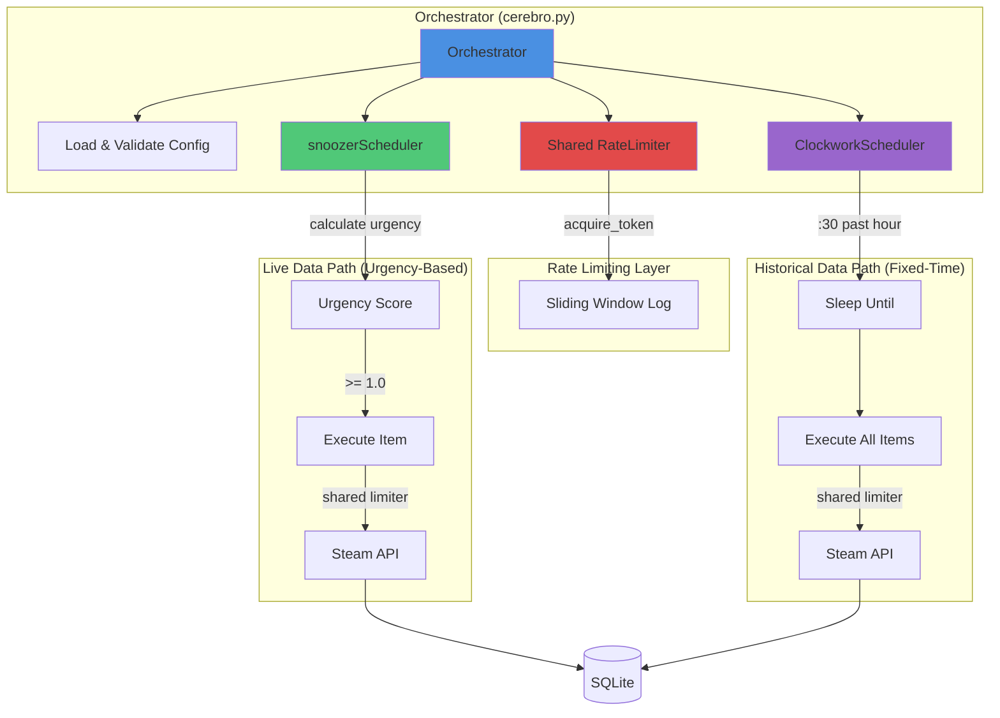

## System Design

The Hridaya Steam Market Tracker is a sophisticated async Python data platform designed to continuously track Steam Community Market data while respecting API rate limits. The architecture follows a coordinated scheduler pattern with shared rate limiting.

## Core Components

<CardGroup cols={2}>
  <Card title="Orchestrator" icon="tower-control" href="/architecture/orchestrator">
    Central coordinator that initializes and manages all schedulers with graceful shutdown
  </Card>
  <Card title="Rate Limiter" icon="gauge-high" href="/architecture/rate-limiter">
    Sliding window algorithm ensuring API compliance across all concurrent requests
  </Card>
  <Card title="Schedulers" icon="clock" href="/architecture/schedulers">
    Dual scheduling system: urgency-based (snoozer) and fixed-interval (clockwork)
  </Card>
  <Card title="API Client" icon="cloud">
    Async HTTP client with automatic data validation and error handling
  </Card>
</CardGroup>

## Architecture Diagram



## Data Flow

### 1. Initialization Phase

```python
# cerebro.py:196-214
async def run(self):
    # Load and validate configuration
    self.load_and_validate_config()
    
    # Setup schedulers with shared rate limiter
    self.setup_schedulers()
    
    # Setup signal handlers for graceful shutdown
    self.setup_signal_handlers()
```

**Key validations:**
- Required fields per endpoint type
- Rate limit feasibility calculation
- Startup burst warnings

### 2. Runtime Phase

Both schedulers run concurrently, sharing a single `RateLimiter` instance:

<CodeGroup>
```python snoozerScheduler (Urgency-Based)
# Execute ALL overdue items immediately
for item in self.live_items:
    urgency = self.calculate_urgency(item)
    if urgency >= 1.0:
        await self.execute_item(item)  # Rate limited

# Sleep until next item becomes urgent
if not executed_any:
    sleep_duration = self.calculate_min_sleep_duration()
    await asyncio.sleep(sleep_duration)
```

```python ClockworkScheduler (Fixed-Time)
# Calculate next :30 past the hour
next_execution = self.get_next_execution_time()
sleep_seconds = self.calculate_sleep_duration(next_execution)

# Sleep until scheduled time
await asyncio.sleep(sleep_seconds)

# Execute all history items (rate limited)
await self.execute_history_items()
```
</CodeGroup>

### 3. Request Execution

Every API call follows this pattern:

```python
# steamAPIclient.py:72-73 (example from fetch_price_overview)
async def fetch_price_overview(...):
    # CRITICAL: Acquire rate limit token before making request
    await self.rate_limiter.acquire_token()
    
    # Make HTTP request
    async with self.session.get(url, params=params) as response:
        response.raise_for_status()
        return PriceOverviewData(**await response.json())
```

**The rate limiter ensures:**
- Maximum N requests per window (configured in `config.yaml`)
- No request proceeds without a token
- Automatic queuing when limit is reached

## Configuration-Driven Design

The system is entirely controlled by `config.yaml`:

```yaml
LIMITS:
  REQUESTS: 100          # Max requests per window
  WINDOW_SECONDS: 300    # 5-minute window

TRACKING_ITEMS:
  - market_hash_name: "AK-47 | Redline (Field-Tested)"
    apiid: priceoverview
    appid: 730
    polling-interval-in-seconds: 60
    
  - market_hash_name: "AWP | Asiimov (Field-Tested)"
    apiid: itemordershistogram
    appid: 730
    item_nameid: 176240541
    polling-interval-in-seconds: 120
```

**Feasibility validation** prevents impossible configurations:

```python
# cerebro.py:112-139
def validate_config_feasibility(self, rate_limit, window_seconds, items):
    total_reqs = sum(
        window_seconds // item['polling-interval-in-seconds']
        for item in items
    )
    
    if total_reqs > rate_limit:
        print(f"❌ CONFIG ERROR: Infeasible configuration")
        exit(1)
```

## Endpoint Scheduling Strategy

| Endpoint | Scheduler | Reason |
|----------|-----------|--------|
| `priceoverview` | snoozerScheduler | Real-time price updates (every 5-60s) |
| `itemordershistogram` | snoozerScheduler | Live order book changes |
| `itemordersactivity` | snoozerScheduler | Recent transaction feed |
| `pricehistory` | ClockworkScheduler | Steam updates hourly, no benefit to polling faster |

## Error Handling & Resilience

### Exponential Backoff (snoozerScheduler)

Transient errors (429, 5xx, network) trigger exponential backoff:

```python
# snoozerScheduler.py:129-159
def apply_exponential_backoff(self, item, error_code):
    item['consecutive_backoffs'] = item.get('consecutive_backoffs', 0) + 1
    
    # Skip N polling intervals, where N = 2^(consecutive - 1), capped at 8
    skip_multiplier = min(2 ** (item['consecutive_backoffs'] - 1), 8)
    skip_seconds = item['polling-interval-in-seconds'] * skip_multiplier
    
    item['skip_until'] = datetime.now() + timedelta(seconds=skip_seconds)
```

**Backoff progression:**
- 1st error: skip 1 interval
- 2nd consecutive: skip 2 intervals
- 3rd consecutive: skip 4 intervals
- 4th+ consecutive: skip 8 intervals (capped)

### Fixed Retry Logic (ClockworkScheduler)

Historical data uses fixed retry delays:

```python
# clockworkScheduler.py:124
backoff_seconds = [30, 60, 120, 240]  # 30s → 1m → 2m → 4m
```

## Graceful Shutdown

Signal handlers ensure clean termination:

```python
# cerebro.py:181-194
def setup_signal_handlers(self):
    loop = asyncio.get_event_loop()
    for sig in (signal.SIGINT, signal.SIGTERM):
        loop.add_signal_handler(
            sig,
            lambda: asyncio.create_task(self.shutdown())
        )

async def shutdown(self):
    print("\n\nShutdown signal received. Stopping schedulers...")
    self.shutdown_event.set()
```

All tasks are cancelled gracefully when shutdown is triggered.

## Database Storage

All fetched data is stored in SQLite (`data/market_data.db`) via the `SQLinserts` class:

```python
# Both schedulers follow this pattern
await self.data_wizard.store_data(result, item)
```

The database layer is abstracted from scheduling concerns, enabling easy migration to PostgreSQL or other backends.

## Performance Characteristics

<AccordionGroup>
  <Accordion title="Startup Behavior">
    All items fire immediately on first run (urgency = ∞). The rate limiter queues them automatically.
    
    **Example:** 50 items configured → all 50 attempt to execute → rate limiter serializes them.
  </Accordion>
  
  <Accordion title="Steady-State Behavior">
    Items spread out naturally based on urgency scores. High-frequency items (30s polling) execute more often than low-frequency items (300s polling).
    
    The system sleeps when no items are urgent, waking only when the next item becomes overdue.
  </Accordion>
  
  <Accordion title="Rate Limit Utilization">
    The orchestrator calculates capacity usage:
    
    ```
    ✓ Config feasible: 87 req/300s (87.0% capacity)
    ```
    
    This assumes worst-case (all items synchronized). Real utilization is typically lower due to urgency-based spreading.
  </Accordion>
</AccordionGroup>

## Next Steps

<CardGroup cols={2}>
  <Card title="Orchestrator Deep Dive" icon="tower-control" href="/architecture/orchestrator">
    Learn about configuration validation and scheduler coordination
  </Card>
  <Card title="Rate Limiter Algorithm" icon="gauge-high" href="/architecture/rate-limiter">
    Understand the sliding window log implementation
  </Card>
  <Card title="Scheduler Strategies" icon="clock" href="/architecture/schedulers">
    Explore urgency-based vs fixed-interval scheduling
  </Card>
  <Card title="Configuration Guide" icon="gear" href="/configuration/overview">
    Set up your tracking configuration
  </Card>
</CardGroup>
